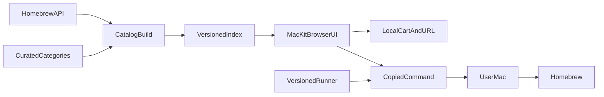

# MacKit Design

Ninite-style macOS setup: browse curated Homebrew apps, search the full formula and cask catalog, add a cart, and install with one guided Terminal command.

## Understanding summary

- MacKit is a web experience for everyday Mac users who may not know Homebrew or Terminal.
- Users browse curated popular apps by category, search Homebrew formulae and casks, and add selections to a cart.
- Checkout produces a guided Terminal command. If Homebrew is missing, the installer explains this and asks before installing it.
- Installation supports Apple Silicon and Intel across the current three macOS major versions, continues past individual failures, and ends with a clear summary.
- Carts stay private and local, require no account, and can be reproduced through package IDs encoded in a shareable URL.
- The MVP is install-only: no Mac App Store, vendor installers, native app, updates, uninstalls, inventory, or analytics.

## Assumptions

- Public-MVP scale: hundreds to a few thousand users per day, no formal availability SLA.
- Usable initial page within about two seconds on typical broadband; near-instant interaction after catalog load.
- Selections must resolve to known Homebrew tokens. Arbitrary package names or URLs are never interpolated into generated commands.
- Generated install behavior is inspectable and deterministic. Cart contents and machine data are never collected.
- Homebrew may request administrator approval; MacKit explains this beforehand.
- Cached catalog data may be used during a temporary Homebrew API outage, with freshness communicated when relevant.
- Desktop-first, responsive on mobile, keyboard accessible, WCAG 2.2 AA.
- One maintainer; hosting, catalog refresh, and category curation must stay low-maintenance.
- Primary success: first-time user from landing page to installation start in under three minutes.
- Secondary success: a setup is repeatable through a shareable URL.

## Non-goals

- Native macOS app, code signing, or notarization.
- Mac App Store, vendor website installers, or third-party taps.
- Accounts, server-side carts, analytics, or telemetry.
- Update, uninstall, or installed-app inventory.
- Pinning exact package versions.

## Architecture

MacKit is mostly static. A scheduled catalog task fetches Homebrew’s official `formula.json` and `cask.json`, validates their schemas, and emits a compact versioned search index. A checked-in curation file assigns featured apps and categories; curation never invents packages outside the validated index.

Next.js renders the landing shell and featured categories. A client-side catalog layer handles search, filtering, and cart state. The cart is persisted in `localStorage`. Sharing serializes sorted typed IDs into the URL. Opening that URL validates every ID against the current catalog before restoring the cart.

At checkout, the browser builds a compact manifest and copies a command that downloads a pinned MacKit installer runner, verifies its SHA-256 digest, and executes it with the manifest as a local argument. The server serves the same auditable runner to everyone and never receives cart contents.

## Product experience

- Homepage is the product. Header: MacKit mark, How it works, Safety, System/Light/Dark theme control.
- Hero: “Set up your Mac in one go.” Large search field for any Homebrew app or CLI tool.
- Featured categories: Browsers, Communication, Development, Design, Productivity, Media, Utilities.
- Package cards: name, one-line purpose, formula/cask type, Add / Added.
- Desktop sticky cart after the first selection; mobile bottom bar opening a sheet.
- Checkout: open Terminal, copy command, paste, follow Homebrew confirmation if needed.
- Share encodes cart IDs in the URL with no account or upload.

## Visual system

- macOS-native clarity with Cursor-inspired restraint: generous spacing, compact controls, fine separators.
- System UI font stack for interface copy; Geist Mono for tokens, keyboard hints, and installer output.
- Light: warm near-white canvas, cool gray surfaces. Dark: deep graphite, not pure black.
- Controlled blue-violet accent for selection, focus, and primary actions.
- Translucent sticky header and cart; opaque cards. 14–16px radii, one-pixel borders, restrained shadows.
- Motion 160–220ms; `prefers-reduced-motion` disables nonessential movement.

## Installer security

- Copied command downloads an immutable versioned runner to a temporary file, verifies SHA-256, then executes it with the cart manifest as a separate argument.
- Manifest contains only a schema version and typed Homebrew tokens.
- Runner never evaluates package text, accepts shell flags from users, adds third-party taps, or executes vendor scripts.
- Missing Homebrew: explain, show official installer URL, ask permission, then invoke Homebrew’s interactive installer.
- MacKit runner does not use `sudo`. Packages install independently. Interrupt with Control-C stops safely.
- No output, machine information, or package list is uploaded.

## Decision log

| Decision | Alternatives | Why |
| --- | --- | --- |
| Package backend: Homebrew formulae and casks | MacPorts, multi-manager | Catalog breadth, official APIs, one beginner path |
| Delivery: script-first guided Terminal flow | Native app, `.command` file | Avoid signing/notarization; inspectable |
| State: browser cart + URL encoding | Accounts, server carts | Privacy and low maintenance |
| Architecture: prebuilt catalog + versioned runner | Live API proxy, fully browser-direct | Speed, privacy, predictable ops |
| Bootstrap: prompt before installing Homebrew | Auto-install, stop with docs | Matches Homebrew’s own interactive installer |
| Failures: continue and summarize | Stop on first error | Beginners still get most of their cart |
| Visual: macOS-native, system-aware light/dark | Dark-first Cursor clone | Familiar Mac feel with Cursor restraint |
| Hosting: Vercel + scheduled catalog rebuild | Custom server | Fits Next.js and solo maintenance |
| Analytics: none | Anonymous events, detailed product analytics | Explicit privacy choice |
| Lifecycle: install only | Updates, uninstall, inventory | YAGNI for MVP |

## Key risks

- Users must trust MacKit’s site and runner. Immutable releases, visible source, checksums, CSP, and constrained deployment reduce but cannot eliminate this trust boundary.
- Homebrew API/schema and package availability can change; contract validation and last-known-good deployments contain failures.
- Intel behavior may diverge from Apple Silicon; CI covers both paths while Homebrew supports them.
- Brand assets have licensing constraints; curated local assets plus generated fallbacks avoid scraping.
- Very large shared carts can exceed practical URL lengths; the MVP enforces a documented package limit.

## Implementation notes

- Web stack: Next.js 16, React 19, TypeScript, Tailwind v4, Bun. Homebrew is the end-user package backend only.
- Cart URL query: `k` with comma-separated `f:token` / `c:token` IDs, sorted, max 50 packages.
- Catalog artifact: `public/catalog/latest.json` plus `public/catalog/meta.json`.
- Runner: `public/install/v1/mackit-install.sh` with SHA-256 in `public/install/v1/mackit-install.meta.json`.
